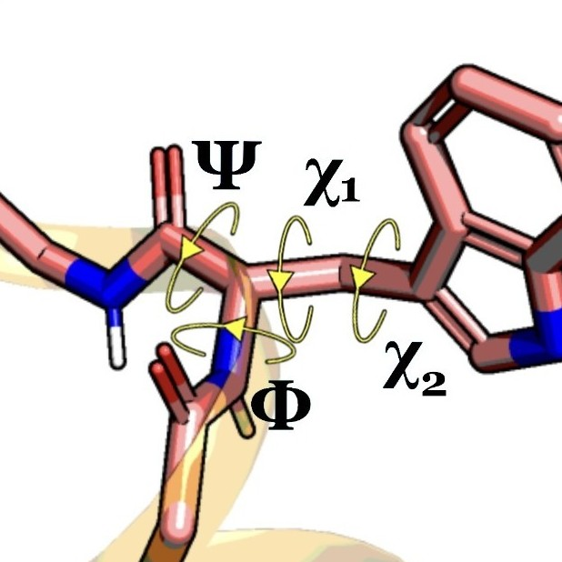
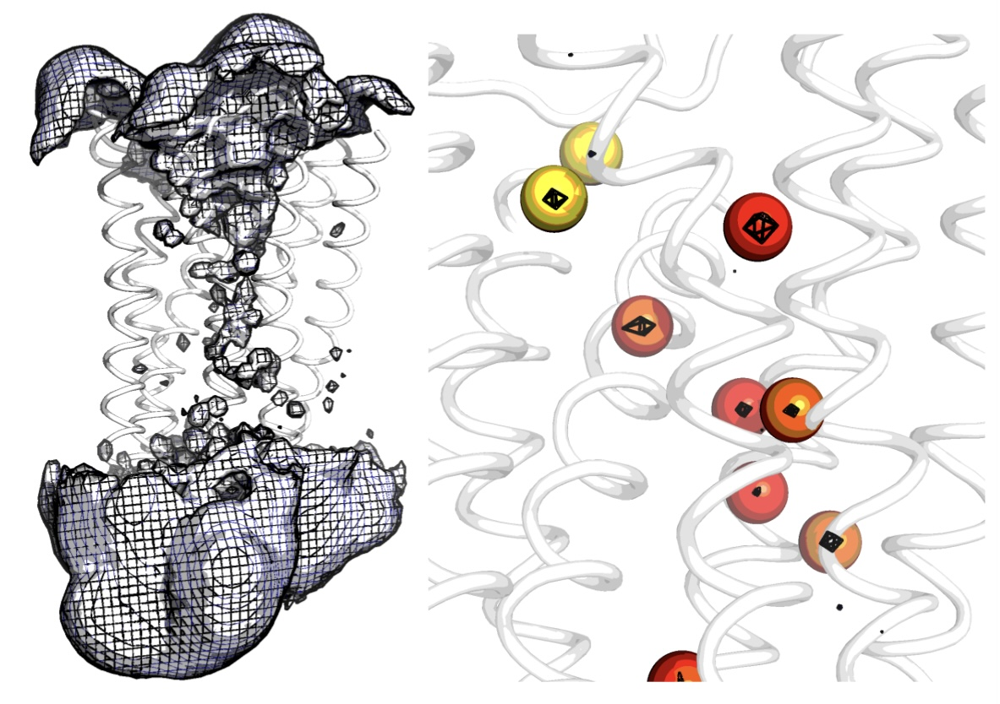

Featurization
=============

The analysis is not performed on the coordinates directly but on
features derived from these coordinates. PENSA already includes 
several feature readers, some of which we show here. You can also 
write your own following the general pattern. 
Note that all reader functions load the names of the features and 
their values separately.

Basic Example
*************

For example, we can read protein backbone torsions.

.. code:: python

    from pensa.features import read_protein_backbone_torsions

    bbtors_feat, bbtors_data = read_protein_backbone_torsions(
        "traj/condition-a_receptor.gro", "traj/condition-a_receptor.xtc",
        selection='all', first_frame=0, last_frame=None, step=1
    )

The first part of the output always contains the names of the features 
and the second part contains the corresponding data.

.. code:: python

    print(bbtors_feat[:3])
    print(bbtors_data[:3])

Having a look at the shape of the loaded data, we see that the first 
dimension is the number of frames. The second dimension is the number 
of features.

.. code:: python

    print("Number of torsions:", len(bbtors_feat))
    print("Data format:", bbtors_data.shape)

PENSA has two simple functions to store features in csv file ...

.. code:: python

    write_csv_features(bbtors_feat, bbtors_data, 'features/bb-torsions_a.csv')

... and to load them again.

.. code:: python

    bbtors_feat, bbtors_data = read_csv_features('features/bb-torsions_a.csv')

Protein Structure Features
**************************

Here we use the special function ``read_structure_features`` that loads 
three types of structure features at once:
- backbone torsions: ``'bb-torsions'``,
- backbone C-alpha distances: ``'bb-distances'``, and
- sidechain torsions: ``'sc-torsions'``.
It was modeled after the feature loader in PyEMMA.

.. code:: python

    from pensa.features import read_structure_features

.. code:: python

    sim_a_rec = read_structure_features(
        "traj/condition-a_receptor.gro", 
        "traj/condition-a_receptor.xtc"
    )
    sim_a_rec_feat, sim_a_rec_data = sim_a_rec

.. code:: python

    sim_b_rec = read_structure_features(
        "traj/condition-b_receptor.gro",
        "traj/condition-b_receptor.xtc"
    )
    sim_b_rec_feat, sim_b_rec_data = sim_b_rec

For this function, the feature names and the data both contain dictionaries 
with entries for each feature type. 

Let's loop through them to make sure that the number of features is the same 
for both simulations. This is a requirement for the further analysis.

.. code:: python

    for k in sim_a_rec_data.keys(): 
        print(k, sim_a_rec_data[k].shape)

.. code:: python

    for k in sim_b_rec_data.keys(): 
        print(k, sim_b_rec_data[k].shape)

Now let's do the same only for the transmembrane region.

.. code:: python

    sim_a_tmr = read_structure_features(
        "traj/condition-a_tm.gro", 
        "traj/condition-a_tm.xtc"
    )
    sim_b_tmr = read_structure_features(
        "traj/condition-b_tm.gro", 
        "traj/condition-b_tm.xtc"
    )
    sim_a_tmr_feat, sim_a_tmr_data = sim_a_tmr
    sim_b_tmr_feat, sim_b_tmr_data = sim_b_tmr
    
    for k in sim_a_rec_data.keys(): 
        print(k, sim_a_rec_data[k].shape)
    for k in sim_b_rec_data.keys(): 
        print(k, sim_b_rec_data[k].shape)
        
        
Water Features
**************

Water molecules are featurized from water density. Unlike residues which 
are fixed to a protein, a single water molecule can move throughout the entire 
simulation box, therefore featurizing a single water molecule does not make sense. 
Instead, it is the spatially conserved internal protein cavities in which water 
molecules occupy that are of interest. Water pocket featurization extracts 
a distribution that represents whether or not a specific protein cavity is occupied 
by a water molecule, and what that water molecule's orientation (polarisation) is. 

.. code:: python

    from pensa.features import read_water_features

For the pdb visualisation, the trajectory needs to be fit to the first frame of the simulation
so that the density and protein align with each other.

Here we featurize the top 2 most probable water sites (top_waters = 2).
Orientation of the waters (water_data - spherical coordinates [radians]) is a 
timeseries distribution. When water is not present at the site, the orientation 
is recorded as 10000.0 to represent an empty state. If write=True, we can 
visualise the pocket occupancies on the reference structure in a pdb file with 
pocket occupancy saved as b_factors. 

You must specify the water model for writing out the grid.
options include:
SPC	
TIP3P
TIP4P	
water	

.. code:: python
    
    struc = "traj/condition-a_water.gro"
    xtc = "traj/condition-a_water.gro"
    water_feat, water_data = read_water_features(
        structure_input = struc, 
        xtc_input = xtc,
        top_waters = 2,
        atomgroup = "OH2",
        write = True,
        write_grid_as="TIP3P",
        out_name = "features/11426_dyn_151_water"
    )

To featurize sites common to both ensembles, we obtain the density grid 
following the steps in the density section of the preprocessing tutorial. 
This way, sites are the same across both ensembles and can be compared.

.. code:: python

    struc = "traj/condition-a_water.gro"
    xtc = "traj/condition-a_water_aligned.xtc"
    grid = "ab_grid_OH2_density.dx"
    water_feat, water_data = read_water_features(
        structure_input = struc,
        xtc_input = xtc,
        top_waters = 2,
        atomgroup = "OH2",
        grid_input = grid
    )

Single-Atom Features
********************

For single atoms we use a similar function which provides the same functionality 
but ignores orientations as atoms are considered spherically symmetric.

.. code:: python

    from pensa.features import read_atom_features

Here we locate the sodium site which has the highest probability. The density is 
written (write=True) using the default density conversion "Angstrom^{-3}" in MDAnalysis.

.. code:: python

    struc = "mor-data/11426_dyn_151.pdb"
    xtc = "mor-data/11423_trj_151.xtc"
    atom_feat, atom_data = read_atom_features(
        structure_input = struc,
        xtc_input = xtc,
        top_atoms = 2,
        atomgroup = "SOD",
        element = "Na",
        write = True,
        out_name = "features/11426_dyn_151_sodium"
    )
                                            
