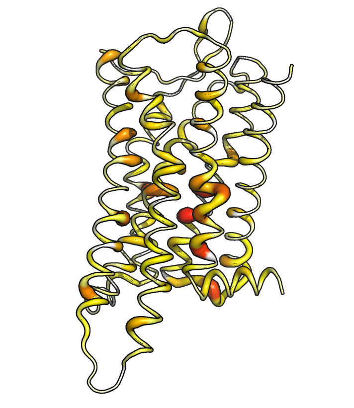
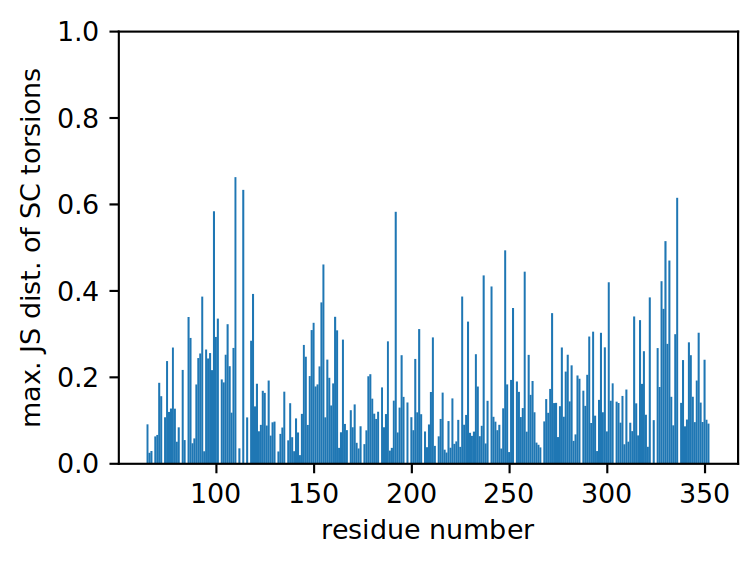
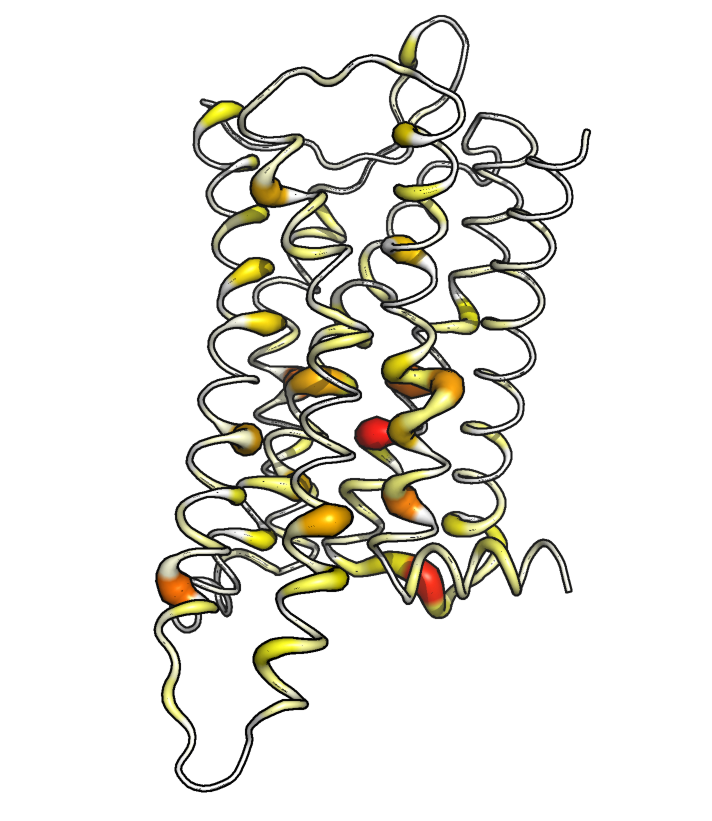
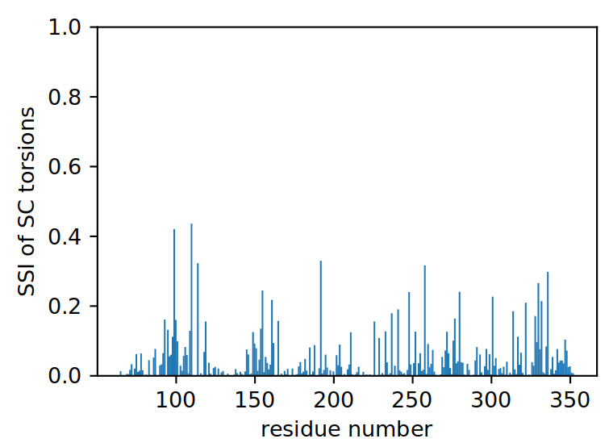
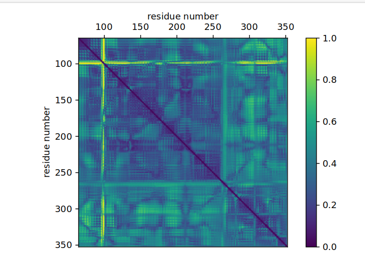

Ensemble Comparison 
===================

Preparation
-----------

First we import the necessary modules.

.. code:: python

    from pensa.comparison import *
    from pensa.features import *
    from pensa.statesinfo import *
    import numpy as np

Then we load the structural features as described in the previous tutorial:

.. code:: python

    sim_a_rec = read_structure_features(
        "traj/condition-a_receptor.gro",
        "traj/condition-a_receptor.xtc"
    )
    sim_b_rec = read_structure_features(
        "traj/condition-b_receptor.gro",
        "traj/condition-b_receptor.xtc"
    )
    sim_a_rec_feat, sim_a_rec_data = sim_a_rec
    sim_b_rec_feat, sim_b_rec_data = sim_b_rec

Relative Entropy
----------------

Here we compare the two ensembles using measures for the relative
entropy.

You can as well calculate the Kolmogorov-Smirnov metric and the
corresponding p value using the function
``kolmogorov_smirnov_analysis()``.

Another possibility is to compare only the means and standard deviations
of the distributions using ``mean_difference_analysis()``.

We start with the backbone torsions, which we can select via
``'bb-torsions'``. To do the same analysis on sidechain torsions,
replace ``'bb-torsions'`` with ``'sc-torsions'``.

.. code:: python

    relen = relative_entropy_analysis(
        sim_a_rec_feat['bb-torsions'], sim_b_rec_feat['bb-torsions'],
        sim_a_rec_data['bb-torsions'], sim_b_rec_data['bb-torsions'],
        bin_num=10, verbose=False
    )
    names_bbtors, jsd_bbtors, kld_ab_bbtors, kld_ba_bbtors = relen 

The above function also returns the Kullback-Leibler divergences of A
with respect to B and vice versa.

To find out where the ensembles differ the most, let's print out the
most different features and the corresponding value.

.. code:: python

    sf = sort_features(names_bbtors, jsd_bbtors)
    for f in sf[:12]: print(f[0], f[1])

To get an overview of how strongly the ensembles differ in which region,
we can plot the maximum deviation of the features related to a certain
residue. The following function also writes the maximum Jensen-Shannon 
distance per residue in the "B factor" field of a PDB file.

.. code:: python

    ref_filename = "traj/condition-a_receptor.gro"
    out_filename = "receptor_bbtors-deviations"
    vis = residue_visualization(
        names_bbtors, jsd_bbtors, ref_filename,
        "plots/"+out_filename+"_jsd.pdf",
        "vispdb/"+out_filename+"_jsd.pdb",
        y_label='max. JS dist. of BB torsions'
    )

Let's now save the resulting data in CSV files.

.. code:: python

    np.savetxt(
        'results/'+out_filename+'_relen.csv',
        np.array(relen).T, fmt='%s', delimiter=',',
        header='Name, JSD(A,B), KLD(A,B), KLD(B,A)'
    )
    np.savetxt(
        'results/'+out_filename+'_jsd.csv',
        np.array(vis).T, fmt='%s', delimiter=',',
        header='Residue, max. JSD(A,B)'
    )

State-Specific Information
--------------------------

In addition, we can investigate differences in discrete conformational microstates 
within the torsion distributions by employing the State Specific Information (SSI) 
analysis in a similar manner. The prime example for this kind of analysis are protein 
sidechain torsions. 

The conformational microstates of each residue are multidimensional, incorporating 
all torsion angles in the definition of a residue's conformational space. This is why 
we first combine all torsions from the same residue to one multivariate feature.

.. code:: python

    multivar_res_feat_a, multivar_res_data_a = get_multivar_res(
        sim_a_rec_feat['sc-torsions'], sim_a_rec_data['sc-torsions']
    )
    multivar_res_feat_b, multivar_res_data_b = get_multivar_res(
        sim_b_rec_feat['sc-torsions'], sim_b_rec_data['sc-torsions']
    )

Then we determine the state boundaries. The distributions are decomposed into the 
individual Gaussians which fit the distribution, and conformational microstates 
are determined based on the Gaussian intersects. It is therefore necessary that each 
state is sampled sufficiently in order to accurately define the conformational states.

.. code:: python

    discrete_states_ab = get_discrete_states(
        multivar_res_data_a, multivar_res_data_b
    )

Now we can run the main SSI comparison.

.. code:: python

    resnames, ssi = ssi_ensemble_analysis(
        multivar_res_feat_a, multivar_res_feat_b,
        multivar_res_data_a, multivar_res_data_b,
        discrete_states_ab, verbose=False
    )

We can plot the results in the same way as we did for the backbone analysis.

.. code:: python
                                             
    ref_filename = "traj/condition-a_receptor.gro"
    out_filename = "receptor_sctors-_ssi"
    vis = residue_visualization(
        resnames, ssi, ref_filename,
        "plots/"+out_filename+"_ssi.pdf",
        "vispdb/"+out_filename+"_ssi.pdb",
        y_label='max. SSI of SC torsions'
    )   

Comparing Distances
-------------------

Another common representation for the overall structure of a protein are
the distances between the C-alpha atoms. We can perform the same kinds of
analysis on them but will need a different approach to visualize them. 
Let's use the relative entropy again:

.. code:: python

    relen = relative_entropy_analysis(
        sim_a_rec_feat['bb-distances'], sim_b_rec_feat['bb-distances'],
        sim_a_rec_data['bb-distances'], sim_b_rec_data['bb-distances'],
        bin_num=10, verbose=False
    )
    names_bbdist, jsd_bbdist, kld_ab_bbdist, kld_ba_bbdist = relen

We print the twelve distances with the highest deviations.

.. code:: python

    sf = sort_features(names_bbdist, jsd_bbdist)
    for f in sf[:12]: print(f[0], f[1])

To visualize distances, we need a two-dimensional representation with
the residues on each axis. We color each field with the value of the
Jensen-Shannon distance (but could as well use Kullback-Leibler
divergence, Kolmogorov-Smirnov statistic etc. instead).

.. code:: python

    matrix = distances_visualization(
        names_bbdist, jsd_bbdist, "plots/receptor_jsd-bbdist.pdf",
        vmin = 0.0, vmax = 1.0, cbar_label='JSD'
    )

