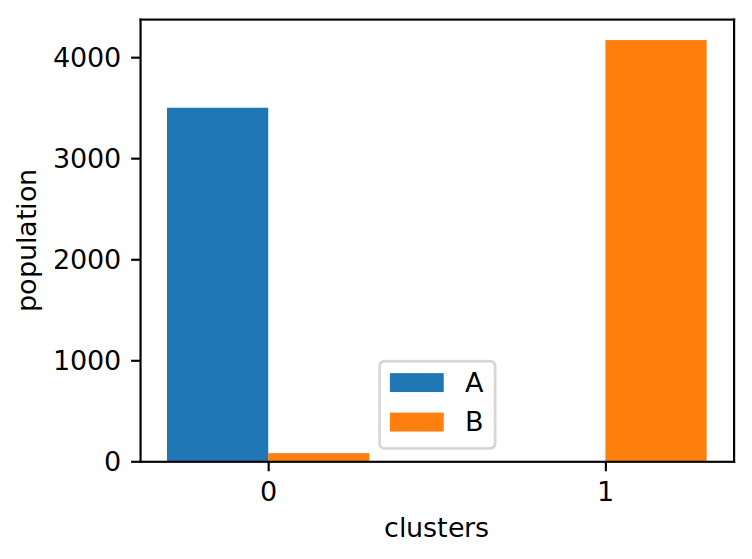

Dimensionality Reduction and Clustering
=======================================

Here we show how to calculate the principal components in the space of
backbone torsions. It is also common to calculate principal components
in the space of backbone distances. For the latter, again just change
``'bb-torsions'`` to ``'bb-distances'``. We then perform k-means clustering 
in the space of the top-three principal components.

We only consider the transmembrane region here, so flexible loops outside 
the membrane do not distort the more important slow motions in the receptor
core.

Preparation
-----------

First we import the necessary modules and functions.

.. code:: python
    
    from pensa.features import read_structure_features
    from pensa.dimensionality import \
        calculate_pca, get_components_pca, pca_eigenvalues_plot, \
        compare_projections, sort_trajs_along_common_pc, sort_traj_along_pc
    from pensa.comparison import pca_feature_correlation
    from pensa.clusters import \
        obtain_clusters, wss_over_number_of_clusters, write_cluster_traj, \
        obtain_combined_clusters, wss_over_number_of_combined_clusters
    import numpy as np

Then we load the structural features as described in the  featurization tutorial.

.. code:: python

    sim_a_tmr = read_structure_features(
        "traj/condition-a_tm.gro", 
        "traj/condition-a_tm.xtc",
        cossin=True
    )
    sim_b_tmr = read_structure_features(
        "traj/condition-b_tm.gro",
        "traj/condition-b_tm.xtc",
        cossin=True
    )
    sim_a_tmr_feat, sim_a_tmr_data = sim_a_tmr
    sim_b_tmr_feat, sim_b_tmr_data = sim_b_tmr
    
Note that here we load the cosine/sine of the torsions instead of their 
values in radians.

Principal Component Analysis (PCA)
----------------------------------

Combined PCA
************

In the spirit of comparing two simulations, we calculate the principal
components of their joint ensemble of structures. First, we combine the data
of the two simulation conditions.

.. code:: python

    combined_data_tors = np.concatenate([sim_a_tmr_data['bb-torsions'], sim_b_tmr_data['bb-torsions']], 0)

We can now calculate the principal components of this combined dataset.
The corresponding function returns a PyEMMA PCA object, so you can
combine it with all functionality in PyEMMA to perform more advanced or
specialized analysis.

.. code:: python

    pca_combined = calculate_pca(combined_data_tors)

To find out how relevant each PC is, let's have a look at their
eigenvalues.

.. code:: python

    idx, ev = pca_eigenvalues_plot(
        pca_combined, num=12,
        plot_file='plots/combined_tmr_eigenvalues.pdf'
    )

Now we can compare how the frames of each ensemble are distributed along
the principal components.

.. code:: python

    _ = compare_projections(
        sim_a_tmr_data['bb-torsions'], 
        sim_b_tmr_data['bb-torsions'],
        pca_combined,
        label_a='A', label_b='B'
    )

To get a better glimpse on what the Principal components look like, we
would like to visualize them. For that purpose, let us sort the
structures from the trajectories along the principal components instead
of along simulation time. We can then look at the resulting PC
trajectories with a molecular visualization program like VMD.

The trajectory to be sorted does not have to be the same subsystem from
which we calcualted the PCA. Here, we are going to write frames with the
entire receptor, sorted by the PCs of the transmembrane region.

.. code:: python

    _ = sort_trajs_along_common_pc(
        sim_a_tmr_data['bb-torsions'], sim_b_tmr_data['bb-torsions'],
        "traj/condition-a_receptor.gro", "traj/condition-b_receptor.gro",
        "traj/condition-a_receptor.xtc", "traj/condition-b_receptor.xtc",
        "pca/receptor_by_tmr", num_pc=3, start_frame=0
    )

The above function deals with the special case of two input
trajectories. We also provide the functions for a single one (see
below). You use these to calculate PCA for any number of combined
simulations and then sort the single or combined simulations.

The comparison module provides us with an option to find the most 
relevant features of each principal component. Let's have a look at the 
first three components. Here, we define a feature as important if its
correlation with the respective PC is above a threshold of 0.4. The
function also plots the correlation analysis for each PC.

.. code:: python

    _ = pca_feature_correlation(
        sim_a_tmr_feat['bb-torsions'], sim_a_tmr_data['bb-torsions'],
        pca=pca_combined, num=3, threshold=0.4
    )

Single Simulation
*****************

Here are the major steps of a PCA demonstrated for a single simulation.

.. code:: python

    sim_a_tmr_data['bb-torsions'].shape

.. code:: python

    pca_a = calculate_pca(sim_a_tmr_data['bb-torsions'])

.. code:: python

    _ = pca_feature_correlation(
        sim_a_tmr_feat['bb-torsions'], 
        sim_a_tmr_data['bb-torsions'], 
        pca_a, 3, 0.4
    )

.. code:: python

    _ = sort_traj_along_pc(
        sim_a_tmr_data['bb-torsions'],
        "traj/condition-a_receptor.gro",
        "traj/condition-a_receptor.xtc", 
        "pca/condition-a_receptor_by_tmr",
        pca=pca_a, num_pc=3, start_frame=0
    )

Clustering
----------

Combined Clustering
*******************

To identify important states of an ensemble, we can use clustering algorithms. 
Here we show how to cluster a combined ensemble from two simulations into two 
clusters using k-means clustering. A plot will show us how many frames from 
which simulation were sorted in which cluster.

We perform the clustering in the space of the three highest principal components. 
The function `get_components_pca` returns the names and data for these components. 
This output has the same format as features because we can now treat them as 
features themselves.

.. code:: python

    pc_a_name, pc_a_data = get_components_pca(sim_a_tmr_data['bb-torsions'], 3, pca_combined)
    pc_b_name, pc_b_data = get_components_pca(sim_b_tmr_data['bb-torsions'], 3, pca_combined)

We now perform the actual clustering on the combined data.

.. code:: python

    cc = obtain_combined_clusters(
        pc_a_data, pc_b_data, label_a='A', label_b='B', start_frame=0,
        algorithm='kmeans', max_iter=100, num_clusters=3, min_dist=12,
        saveas='plots/combined_clust_bbtors.pdf'
    )
    cidx, cond, oidx, wss, centroids = cc

... and save the results to a CSV file.

.. code:: python

    np.savetxt(
        'results/combined-cluster-indices.csv', 
        np.array([cidx, cond, oidx], dtype=int).T,
        delimiter=',', fmt='%i',
        header='Cluster, Condition, Index within condition'
    )

We can sort the frames from each ensemble into these clusters, writing them as separate 
trajectory files. As with pricipal components, we can look at them using VMD.

.. code:: python

    name = "condition-a_tm"
    _ = write_cluster_traj(
        cidx[cond==0], "traj/"+name+".gro","traj/"+name+".xtc", 
        "clusters/"+"combined_clust_bbtors_"+name, start_frame=0
    )
    name = "condition-b_tm"
    _ = write_cluster_traj(
        cidx[cond==1], "traj/"+name+".gro","traj/"+name+".xtc",
        "clusters/"+"combined_clust_bbtors_"+name, start_frame=0
    )

A common method to obtain the optimal number of clusters is the elbow plot. We plot the 
within-sum-of-squares (WSS) for a few repetitions for an increasing number of clusters. 
Then we look for the "elbow" in the resulting plot. Unfortunately, sometimes there is no 
clear result though.

.. code:: python

    wss_avg, wss_std = wss_over_number_of_combined_clusters(
        pc_a_data, pc_b_data, label_a='A', label_b='B', 
        start_frame=0, algorithm='kmeans', 
        max_iter=100, num_repeats = 5, max_num_clusters = 12,
        plot_file = None
    )

Single Simulation
*****************

Of course, we can also cluster a single simulation.

.. code:: python

    _ci, _wss, _centroids = obtain_clusters( pc_a_data, num_clusters=5 )
    name = "condition-a_tm"
    _ = write_cluster_traj(
        _ci, "traj/"+name+".gro","traj/"+name+".xtc", 
        "clusters/"+"clust_bbtors_"+name, start_frame=0
    )

The analogous function for the WSS in this case is the following:

.. code:: python

    wss_avg, wss_std = wss_over_number_of_clusters(
        sim_a_tmr_data['bb-torsions'], algorithm='kmeans', 
        max_iter=100, num_repeats = 5, max_num_clusters = 12,
        plot_file = None
    )

